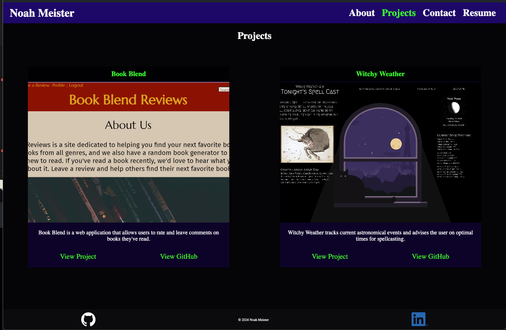

# UTA Coding Bootcamp Challenge  -- React Portfolio

## Description

This is my submission for the React Portfolio challenge in the UTA/EdX Coding Bootcamp. This challenge aimed to create a portfolio for my work using React.

<a href="https://main--noahmeister.netlify.app/">Link</a>

## Installation

N/A

## Usage

The website contains four pages: an about me page, a table of my projects, a contact form, and a resume page. A navbar allows users to navigate through them. On the projects page, each project has links to the deployed application and its GitHub repo.

## Credits

N/A

## License

This repo uses an MIT License. See above for details.
